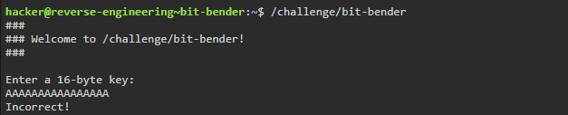
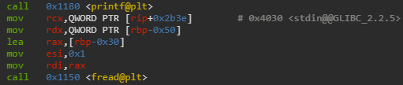
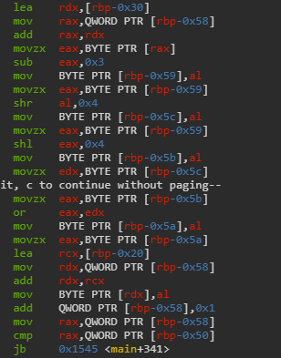
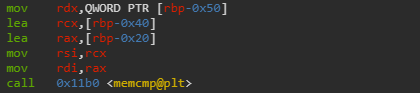
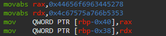
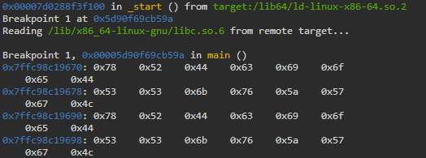
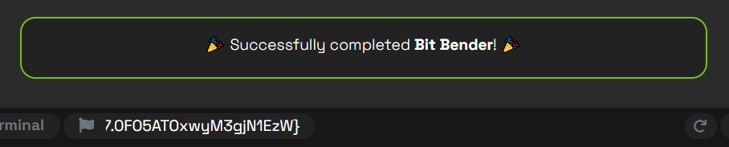

# bit-bender Writeup - pwn.college

**Category:** Binary Exploitation  
**Difficulty:** Medium  

This writeup describes the solution to the **"bit-bender"** challenge from pwn.college.
The goal is to reverse the transformation applied to user input and craft a valid payload that passes the program’s verification logic and reaches the win() function.

---

## Step 1 – First Attempt at Probing

<br>

The program requests exactly 16 bytes of input.

Providing a simple input such as `"AAAAAAAAAAAAAAAA"` does not satisfy the program’s constraints, indicating that further analysis is required.  

---

## Step 2 – Understanding the Program Flow

Running the binary shows that the program expects exactly 16 bytes of input.  

From the disassembly:


The value 0x10 (16) is stored at `[rbp-0x50]`.

Later, the program reads user input using `fread`:  



This means:

```
fread([rbp-0x30], 1, 16, stdin);
```

So:

- User input is stored at `[rbp-0x30]`
- The program expects exactly `16 bytes`

---

## Step 3 – Analyzing the Transformation Loop



The transformation loop processes the input **byte-by-byte**.

By translating the assembly into C-like pseudocode:

```
for (size_t i = 0; i < 16; i++) {
    unsigned char b = input[i];

    // subtract constant offset
    b = b - 3;

    // swap upper and lower nibbles
    unsigned char result = (b << 4) | (b >> 4);

    output[i] = result;
}
```

The transformed bytes are written into: `[rbp-0x20]`.

---

## Step 4 – Finding the Expected Value



After the transformation loop finishes, the program compares the generated output against a constant value stored on the stack.  

The comparison is:  

```
memcmp([rbp-0x20], [rbp-0x40], 16)
```

The target bytes stored at `[rbp-0x40]` are initialized earlier:  



The target bytes in memory are:
```
78 52 44 63 69 6f 65 44 53 53 6b 76 5a 57 67 4c
```

ASCII representation:
```
xRDcioeDSSkvZWgL
```

Therefore, we aim to satisfy:
```
transform(input) == "xRDcioeDSSkvZWgL"
```

---

## Step 5 – Reversing the Transformation

The transformation applied by the program is:  

```
result = swap_nibbles(input_byte - 3)
```

To recover the original input, we reverse the operations:  

1. Swap the nibbles again
2. Add `3`
  
Example for the first byte:  

Target byte:  
```
0x78
```

Swap nibbles:  
```
0x87
```

Add `3`:  
```
0x8a
```

Applying the same reversal to all 16 bytes produces:   
```
8a 28 47 39 f9 59 47 38 38 b9 6a a8 78 79 c7
```

---

## Step 6 – Crafting and Verifying the Exploit

The following pwntools script sends the reconstructed payload and attaches GDB immediately before the `memcmp` call:

```python
# exploit.py
from pwn import *

context.terminal = ['tmux', 'splitw', '-h']

gdbscript = """
b *main+426
c
x/16bx $rbp-0x40
x/16bx $rbp-0x20
"""

p = gdb.debug("/challenge/bit-bender", gdbscript=gdbscript)

payload = (
    b"\x8a\x28\x47\x39\xf9\x59\x47\x38\x38\xb9\x6a\xa8\x78\x79\xc7"
)

p.send(payload)

p.interactive()
```

The additional GDB commands dump both memory buffers immediately before the `memcmp` call:  

- `[rbp-0x40]` contains the expected target bytes
- `[rbp-0x20]` contains the transformed user input

By comparing the two buffers directly in memory, we can verify that the reconstructed payload produces the exact expected output.



Both buffers contain identical values, confirming that the transformed payload matches the expected target bytes before `memcmp` executes.

Since both buffers match, `memcmp` returns `0` and execution reaches `win()`.  


---

## Step 7 – Retrieving the Flag

Running the exploit successfully triggers the `win()` function and reveals the flag.


The successful execution confirms that the reconstructed payload correctly reverses the program’s byte transformation routine.



---

## Summary and Insights

This challenge involved reversing a byte-level transformation applied to user input before comparison.  

The main difficulty came from combining arithmetic manipulation with bitwise operations (nibble swapping), which obscured the original input at first glance.  

By reverse engineering the transformation step-by-step, we reconstructed the exact input that satisfies the program’s validation check and successfully triggers `win()`.  

The key insight is that even simple-looking transformations can significantly obfuscate logic in assembly, but remain fully reversible once the full pipeline is understood.  
 
# Key takeaways:  

- Understanding stack-based buffer layout
- Translating assembly loops into high-level logic
- Reasoning about bitwise operations
- Reversing deterministic transformations instead of brute forcing

