# buffer-overflow Writeup - picoCTF

**Category:** Binary Exploitation  
**Difficulty:** Medium

This writeup describes the solution to the **"buffer-overflow"** challenge from picoCTF.
The goal of the challenge is to exploit a buffer overflow vulnerability in order to redirect execution flow to the `win()` function, which prints the flag.

---

## Step 1 – Downloading the Challenge

I opened the picoCTF challenge and downloaded the provided files.

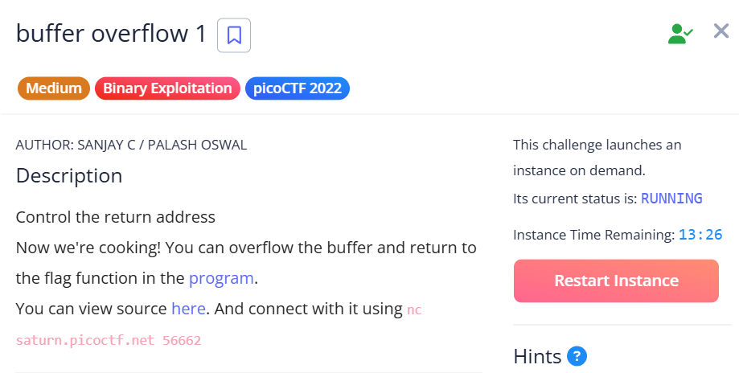

---

## Step 2 – First Attempt at Probing

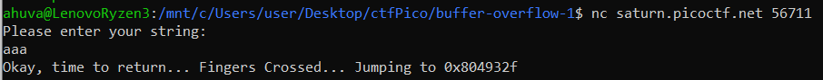

A simple input such as `"aaa"` does not trigger the flag, so further investigation is required.

Let's examine the source code in `vuln.c`.

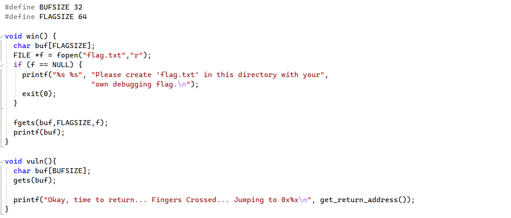

The goal is to redirect execution to the `win()` function, which prints the flag.
But how do we get there?

The buffer holds **32 bytes** — but what happens if we input more?
Could we reach the return address?

---

## Step 3 – Inspecting the Program with GDB

Let's run the executable using **gdb** and inspect the `vuln` function.

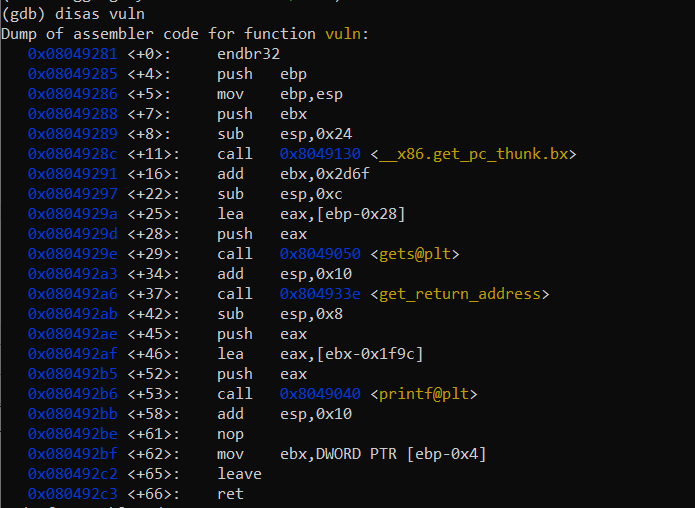

The following lines are particularly interesting:

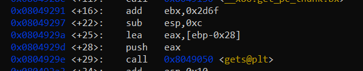

The buffer is located at `[ebp-0x28]`.

The saved **EBP** occupies 4 bytes above it.

Therefore, to reach the return address we must send:

```
0x28 + 0x4 = 0x2c (44 bytes)
```

---

## Step 4 – Locating the Target Function

Now we need to determine **which address should overwrite the return address**.

Let's find the address of the `win()` function.

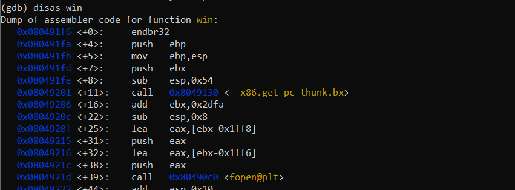

---

## Step 5 – Crafting the Payload

We will build the payload using **ipython**.

To exploit the vulnerability we craft the following payload:

```
"A"*0x2c + address_of_win
```

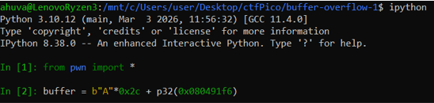

---

## Step 6 – Exploiting the Remote Service

Next, we connect to the remote challenge server.

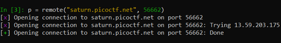

We then send the payload we created.

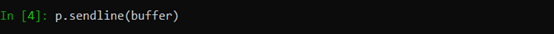

---

## Step 7 – Retrieving the Flag

And here we are — we found the flag!

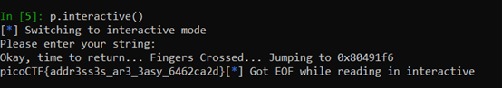

After sending the payload to the remote service, execution jumps directly to address `0x080491f6`.
This is the start of the `win()` function, which returns the flag.

The challenge confirms that the exploit worked successfully.

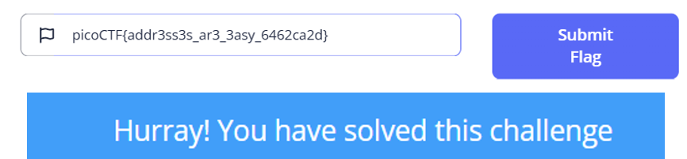

---

## Summary and Insights

The buffer overflow allows us to overwrite the **saved return address**, redirecting execution to the `win()` function.

This demonstrates a classic **stack-based buffer overflow vulnerability**, where improper input handling allows an attacker to hijack the program's control flow.
