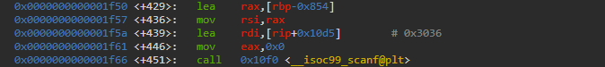
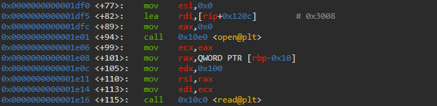
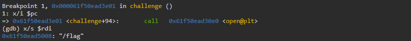
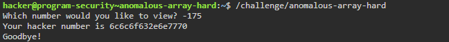
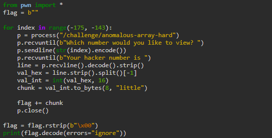

# anomalous-array Writeup - pwn.college

**Category:** Memory Corruption  
**Difficulty:** Hard

This writeup describes the solution to the **"anomalous-array"** challenge from pwn.college.  
The goal is to exploit an out-of-bounds array access vulnerability in order to read arbitrary memory from the stack and ultimately leak the flag.

---

## Step 1 – First Attempt at Probing

The program expects to number to view. when I choose 1, I saw that the hacker number is 1337c0de. What will happen with another number as an input?

We will try to enter the standings through DGB.

---

## Step 2 – Observation via GDB

So what we see in Gdb?

These lines This print: "Which number would you like to view?"

After we insert the input with `scanf` function, we see that its take the input (as number) and calculate the hacker number to print:

That is, we have an array that starts at the address: $rbp+8*0xAE-0x7F8 (which is actually: rbp - 0x288), and we enter an index as input. The hacker number that is printed is the array in place of the index we entered.
This is nice, but where I can find the flag? let's take view about what happen before:

Beatuiful! This is open the "flag" file, and store the flag on the stack (at rbp - 0x10). But rbp - 0x10 is only a **pointer** to the palce that the flag stored. Where the flag itself is located?

Exactly here - at rbp - 0x800!

---

## Step 3 – Identifying the Vulnerability

Conclusion from the gdb:
the start of the array - rbp - 0x288
the place of the flag - rbp - 0x800 (above to the array)
so, a regular index will not help to arraive to the flag, but if we insert as an input a nagetive number?
The negative index that will lead me to the tart of the flag is: - (0x88 - 0x288) / 8 = -0xAF (-175 in dec).
let's try it:

---

## Step 4 – Exploitation Strategy

When I examine the printf funtion of the hacker number I duscover 2 problems:

1. The format is unsigned long, and I want to print all the flag, not only the 8 first bytes.
2. The format is hexadecimal, and I want to convert it to string format for see the flag.

So, I want to build **python** script that will solve these problems - its will execuate the program 32 times (because the length of the flag is maxsimum 0x100, and in each time this prints 8 bytes), and in each time I convert this ti ascii. In the end, I will print the Unification of all chunks of the flag.

---

## Step 5 –  Retrieving the Flag

I execuated this code and after 32 times got the complete 
flag:

The successful exploitation confirms full control over the program’s execution flow.

---

## Summary and Insights

This challenge demonstrates how improper bounds checking on array indices can lead to **out-of-bounds memory access**.

By allowing negative indices, the program enables reading memory located *before* the array on the stack. This makes it possible to leak sensitive data, such as the flag.

Additionally, the challenge highlights an important detail: even when memory is accessed in fixed-size chunks (e.g., 8 bytes), it is still possible to reconstruct larger secrets by repeatedly querying adjacent memory locations.

This is a classic example of how **information disclosure vulnerabilities** can arise from seemingly simple logic flaws, without requiring control over execution flow.

להוסיף שאלה לצאט - שיעצב לי את זה

