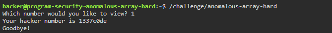
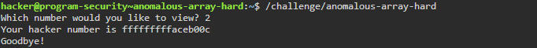
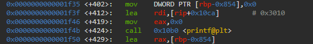
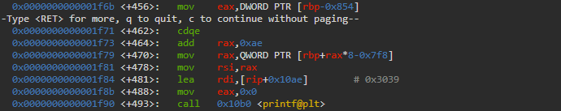
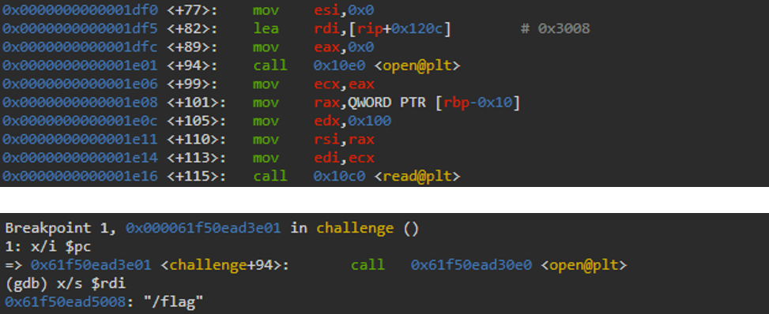
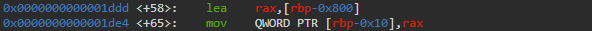
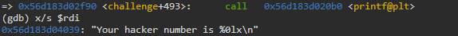
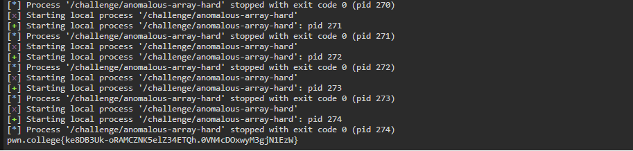
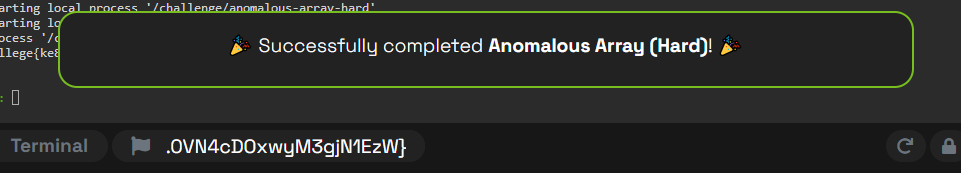

# anomalous-array Writeup - pwn.college

**Category:** Memory Corruption  
**Difficulty:** Hard  

This writeup describes the solution to the **"anomalous-array"** challenge from pwn.college.  
The goal is to exploit an **out-of-bounds array access vulnerability** in order to read arbitrary memory from the stack and ultimately leak the flag.

---

## Step 1 – Understanding the Challenge



The program asks the user to choose an index to view.

When selecting index `1`, the program prints the value `0x1337c0de`.  
This suggests that the program retrieves values from an internal array.



Trying additional inputs confirms that different indices return different values.  
This indicates that user input is directly used as an array index.

---

## Step 2 – Initial Observation (GDB)

To better understand the program’s behavior, we analyze it using GDB.



The program first prints the prompt:  

```
Which number would you like to view?
```

<br>

User input is read using `scanf`, which stores the provided index.



The program then uses this index to access an array and prints the corresponding value.

---

## Step 3 – Stack Layout Analysis

By inspecting the disassembly, we can reconstruct the memory layout:

- Array base address: `rbp - 0x288`
- Flag location: `rbp - 0x800`



The program opens the `"flag"` file and reads its contents into memory.



The flag is stored on the stack at `rbp - 0x800`.

This location is **before the array in memory**, meaning it cannot be accessed using standard (positive) indices.

---

## Step 4 – Identifying the Vulnerability

The program does not validate the index provided by the user.

This allows the use of **negative indices**, which access memory *before* the array.

Since the flag is located before the array, this creates an **out-of-bounds read vulnerability**, enabling leakage of the flag.

---

## Step 5 – Calculating the Offset

We compute the index required to reach the flag location:

```
array base = rbp - 0x288
flag start = rbp - 0x800
```

Distance:
```
0x800 - 0x288 = 0x578 bytes
```

Since each array element is 8 bytes:
```
index = - (0x578 / 8) = -0xAF (-175)
```

Using this negative index allows access to the beginning of the flag.


---

## Step 6 – Exploitation Strategy

<br>

The output is printed using `%lx`, meaning:

- Only **8 bytes** are printed at a time    
- Output is in **hexadecimal format**  

To reconstruct the full flag:

1. Repeatedly query consecutive indices
2. Convert each 8-byte chunk from hex to ASCII
3. Concatenate all chunks

The following script automates this process:

```python
# exploit.py
from pwn import *
flag = b""
 
for index in range(-175, -143):
    p = process("/challenge/anomalous-array-hard")
    p.recvuntil(b"Which number would you like to view? ")
    p.sendline(str(index).encode())
    p.recvuntil(b"Your hacker number is ")
    line = p.recvline().decode().strip()
    val_hex = line.strip().split()[-1]
    val_int = int(val_hex, 16)
    chunk = val_int.to_bytes(8, "little")

    flag += chunk
    p.close()

flag = flag.rstrip(b"\x00")
print(flag.decode(errors="ignore"))
```

---

## Step 7 – Retrieving the Flag

Running the script iteratively allows reconstructing the full flag:



The successful leak confirms that arbitrary stack memory can be read via the vulnerability.



---

## Summary and Insights

This challenge demonstrates how improper bounds checking on array indices can lead to **out-of-bounds memory access**.

By allowing negative indices, the program enables reading memory located *before* the array on the stack. This makes it possible to leak sensitive data, such as the flag.

Additionally, the challenge highlights that even when memory is accessed in fixed-size chunks (e.g., 8 bytes), it is still possible to reconstruct larger secrets by repeatedly querying adjacent memory locations.

This is a classic example of an **information disclosure vulnerability**, where a simple logic flaw leads to unintended exposure of sensitive data without requiring control over execution flow.

