# keygenme Writeup - picoCTF

**Category:** Reverse Engineering  
**Difficulty:** Hard  

This writeup describes the solution to the **"keygenme"** challenge from picoCTF.

The goal of the challenge is to reverse engineer the binary in order to understand how the license key is generated and provide a valid key that passes the program's verification logic.

---

## Step 1 – Downloading the Challenge

I downloaded the provided binary from the picoCTF challenge page.

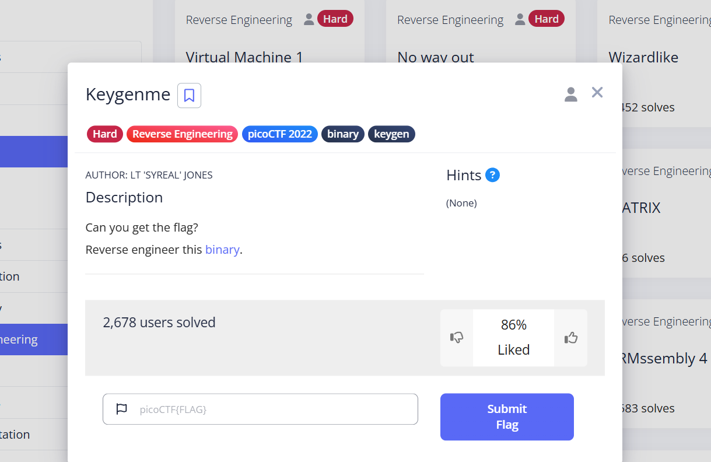

---

## Step 2 – Initial Analysis

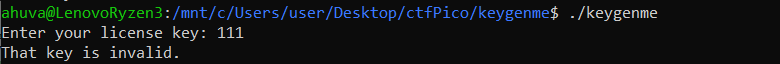

Providing a simple input such as `"111"` does not result in a valid key, indicating that the program performs some internal validation.

Opening the binary in **IDA** reveals incomplete or unclear logic, suggesting that the binary might be packed or obfuscated.

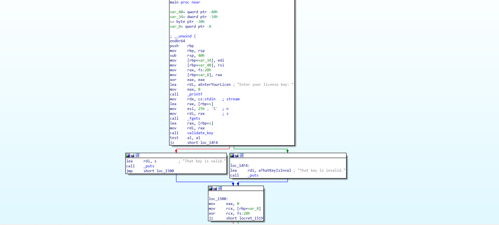

---

## Step 3 – Identifying the Validation Function

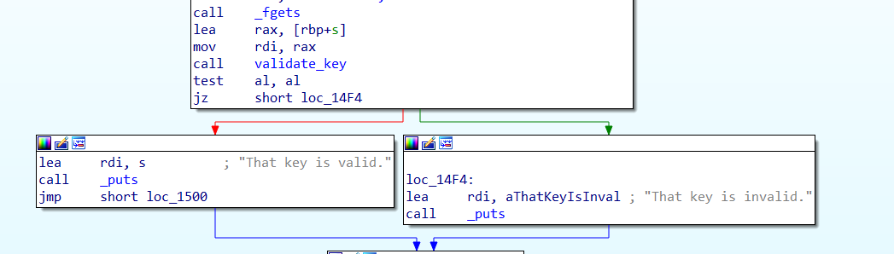

The program reads user input using `fgets` and passes it to a function responsible for validation (renamed to `validate_key` for clarity).

In order for the program to accept the input as valid (i.e., print "That key is valid"), this function must return a non-zero value.  

---

## Step 4 – Reverse Engineering the Validation Logic

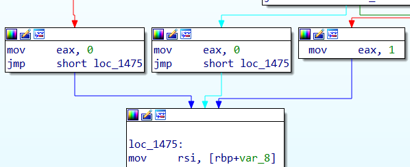

The function has multiple return paths, but only one leads to a successful validation (return value `1`).

To understand how to reach this path, we analyze the function step by step.1

---

### Step 4.1 – Input Handling

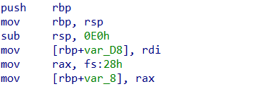

The user input is stored in a buffer (`var_D8`).

---

### Step 4.2 – Key Construction

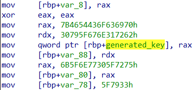

The program constructs a base string in a buffer (renamed to `generated_key` for clarity), storing it in memory as hexadecimal values (as seen in the image):

```
picoCTF{br1ng_y0ur_0wn_k3y_
```

This string is stored in chunks and later combined into a single buffer.

---

### Step 4.3 – MD5 Hashing

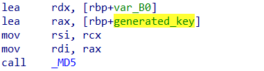

The program computes the **MD5 hash** of the base string.

The hash is then converted into a hexadecimal string representation:

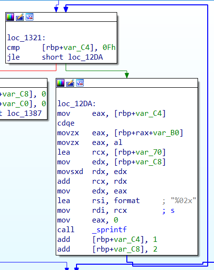

---

### Step 4.4 – Final Key Generation

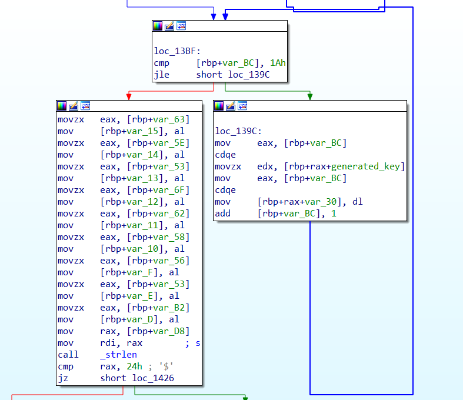

The constructed key (`generated_key`) is copied into another buffer (`var_30`) and modified by appending part of the computed hash.

Specifically, a portion of the MD5 hash (converted to hexadecimal) is appended to the base string.

The final generated key becomes:

```
picoCTF{br1ng_y0ur_0wn_k3y_19836cd8}
```

---

### Step 4.5 – Length Check and Comparison

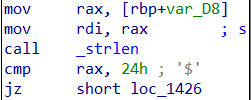

The program verifies that the input length is exactly `0x24` (36 bytes), which matches the **generated key length**.

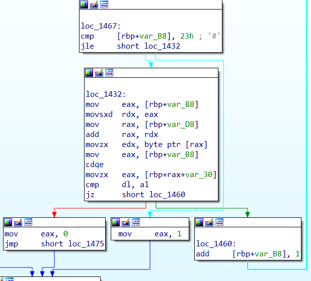

It then compares:

- User input (`var_D8`)
- Generated key (`var_30`)

If they are equal, the function returns `1`, indicating a valid key.

At this point, the required input is fully reconstructed.

---

## Step 5 – Retrieving the Flag

Providing the generated key:

```
picoCTF{br1ng_y0ur_0wn_k3y_19836cd8}
```

results in successful execution and the program prints:

```
That key is valid
```

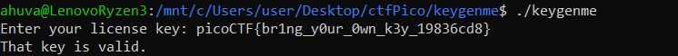

This confirms that the reconstructed key is correct.


---

## Summary and Insights

This challenge demonstrates a classic **keygenme pattern**, where the program generates a valid key internally and compares it to user input.

By reversing the binary, we can reconstruct the key generation logic and recover the correct input directly.

Key takeaways:

- Validation logic is often deterministic and can be reversed.
- Even when hashes are used, the final value can be recovered if the full computation is visible.
- Many checks ultimately reduce to a simple string comparison.

This highlights how reverse engineering can be used to derive valid inputs without guessing.