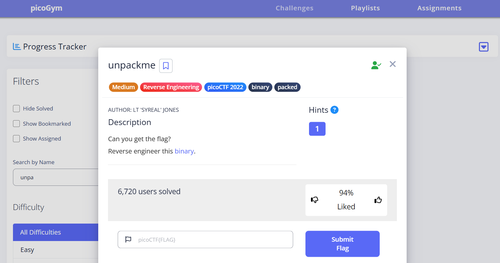
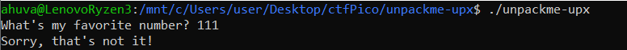
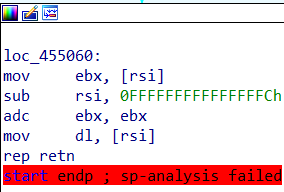
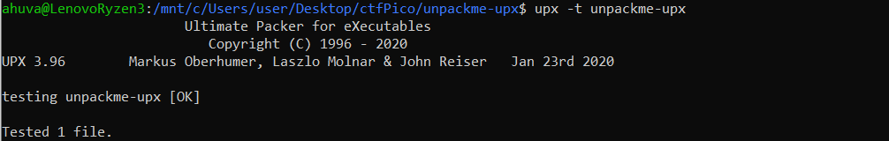
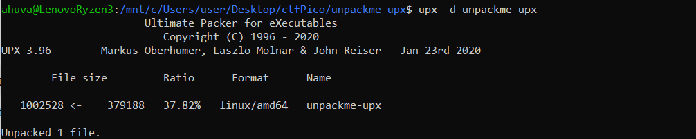
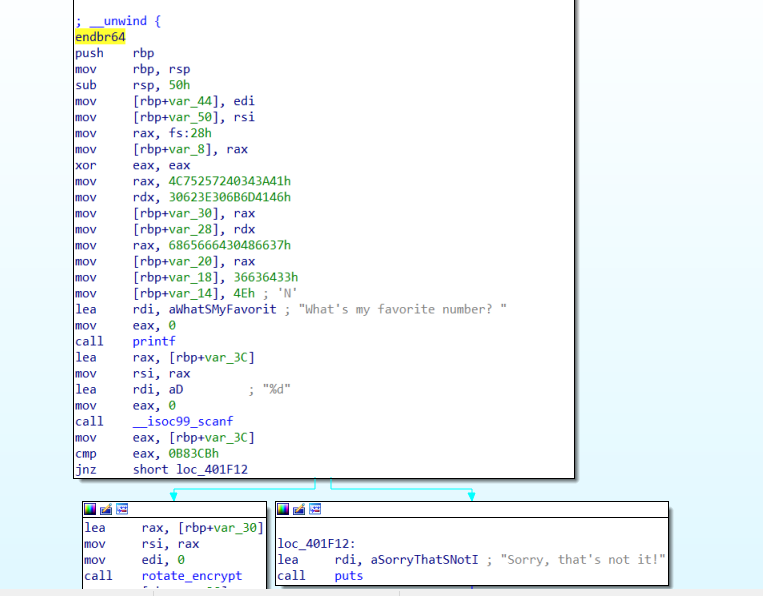
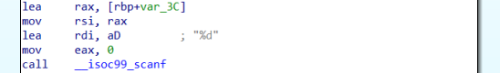
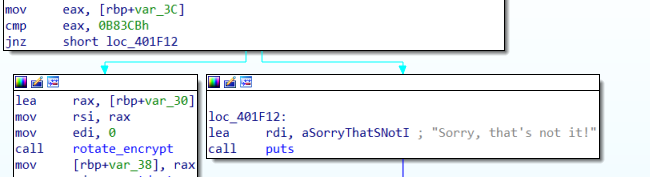
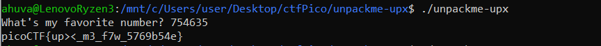

# unpackme Writeup - picoCTF

**Category:** Reverse Engineering  
**Difficulty:** Medium

This writeup describes the solution to the **"unpackme"** challenge from picoCTF.

The goal of the challenge is to unpack a compressed binary and reverse engineer it in order to retrieve the flag.

---

## Step 1 – Downloading the Challenge

I opened the picoCTF challenge and downloaded the provided files.

---

## Step 2 – First Attempt at Probing

Providing a simple input such as `"111"` does not reveal the flag, indicating that further analysis is required.

When opening the binary in **IDA**, the code appears incomplete. This suggests that the binary might be packed or compressed.

---

## Step 3 – Unpacking the file

The issue is that the binary is packed using UPX.

To unpack it, we run:

`upx -d unpackme-upx`

After unpacking, the binary can be fully analyzed in IDA.

---

## Step 4 – Reverse engineering the binary file

After analyzing the `main` function, we can identify user input handling using `scanf`.

The program reads user input using `scanf` and stores it at `[rbp + var_3c]`.

Immediately after, the input value is moved into `eax` and compared against the constant `0x0B83CB`. If the input matches this value, execution jumps to the success branch, which prints the flag.

---

## Step 5 – Retrieving the Flag

Converting `0x0B83CB` to decimal gives `754635`.

Providing this input results in successful execution and reveals the flag.

The challenge confirms that the exploit worked successfully.

---

## Summary and Insights

This challenge demonstrates the importance of **identifying packed binaries and properly unpacking** them before performing reverse engineering.

Once unpacked, **standard analysis tools** such as IDA can be used to trace program logic and identify the required input.
